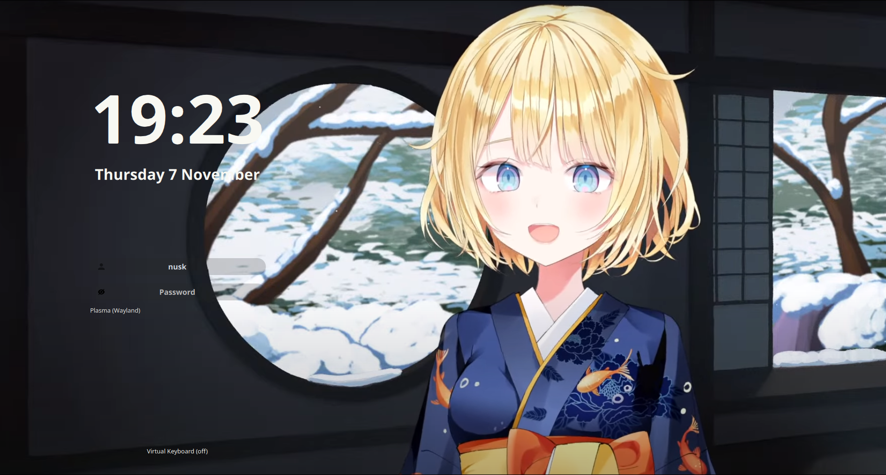

# amelia-sddm-theme

A theme for the [SDDM login manager](https://github.com/sddm/sddm).

- Screen resolution: 1080p
- Font: Open sans

### Preview

You can easily change how it looks in **[config](./theme.conf)**. 
Here are some examples:




### Dependencies

#### Arch
```sh
sddm qt6-svg
```

### Install

1. Clone this repository, copy fonts to `/usr/share/fonts/`:

   ```sh
   sudo git clone https://github.com/Nusk-Rbb/amelia-sddm-theme.git /usr/share/sddm/themes/amelia-sddm-theme
   sudo cp /usr/share/sddm/themes/amelia-sddm-theme/Fonts/* /usr/share/fonts/
   ```

2. Then edit `/etc/sddm.conf`, so that it looks like this:

    ```sh
    echo "[Theme]
    Current=amelia-sddm-theme" | sudo tee /etc/sddm.conf
    ```

### Credits

Based on the theme [`Sugar Dark for SDDM`](https://github.com/MarianArlt/sddm-sugar-dark) by **MarianArlt**.